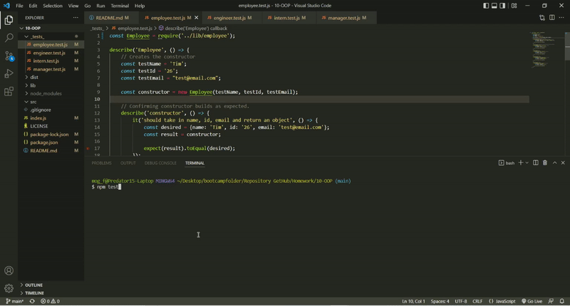

# Note Taker
UT Bootcamp Homework #10 - Object Oriented Programing

## Description:

## How to Use:

## Website Visual Demo(Gif/video):
  
<a href="">Video Demo</a>

## Link to Deployed Page:

## References:
Test code inspired by UT Web Dev Bootcamp: UTA-VIRT-FSF-FT-03-2022-U-LOL

## Development Process (See commits for more details):
Created base files and outline  
Pseudocoded based off acceptance criteria/README.md 
Tested classes using Jest
Continued after passing all tests