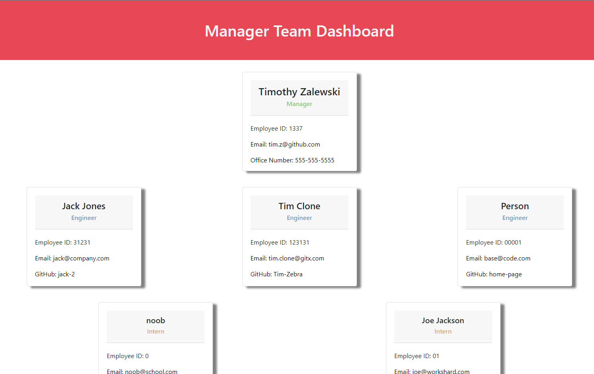
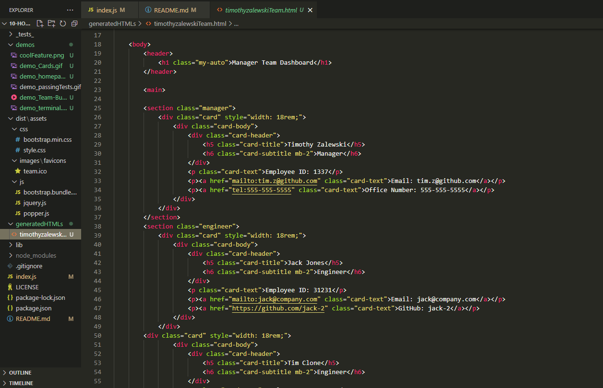
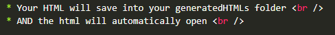
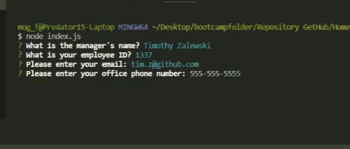

# Team Builder
UT Bootcamp Homework #10 - Object Oriented Programing

## Description:
A simple team builder that takes in manager information, and allows the manager to add team members. Once added, the information will export as an html file.    

 ## Table of Contents:

  **[How to Use](#how-to-use)**  
  **[Application Demos](#application-demos)**  
  **[Link to Deployed Page](#link-to-deployed-page)**  
  **[References](#references)**  
  **[Devlopment Process](#development-process)**  
  **[Author](#author)**  

## How to Use:
* Enter in the manager's information
* Then select either: 'Add Engineer', 'Add Intern', or 'Stop building team'
* If you choose either Add Engineer or Add Intern, follow the prompts to populate their information
* Choose 'Stop building team' to finalize your team
* Your HTML will save into your generatedHTMLs folder
* AND the html will *automatically open*

## Website Visual Demo(Gif/video):
<h2 align="center">Homepage</h2>

   
<h2 align="center">Generated HTML</h2>

  
<h2 align="center">Cool Feature/Auto Open Upon Exiting Terminal</h2>

  
<h2 align="center">Passing Tests</h2>

  <h2 align="center">Team Builder</h2>

  
<h2 align="center">HTML display</h2>

  

<a href="https://drive.google.com/file/d/1U-1swBech54cXyp0kz1k_hjd7ZzuixeY/view">Video Demo</a>

## Link to Deployed Page:
N/A

## References:
* Test code inspired by UT Web Dev Bootcamp: UTA-VIRT-FSF-FT-03-2022-U-LOL  
* Array storage inspired by: <a href="https://github.com/yummy314159265">Rodin</a>  
* Card obtained from: https://getbootstrap.com/docs/4.0/components/card/

## Development Process (See commits for more details):
1. Created base files and outline  
2. Pseudocoded based off acceptance criteria/README.md  
3. Tested classes using Jest  
4. Continued after passing all tests  
4. Created input using inquirer  
6. Learned a lesson: Turned in 70% functional to make deadline, even though final deadline was not for 5+ weeks  
7. Pseudocoded HTML components  
8. Generated HTML doc and added components  
9. Add some UX (Save HTML doc, then auto-open)

## Author:
Created by Timothy Zalewski | Deployed on [GitHub](https://github.com/Tim-Zebra)